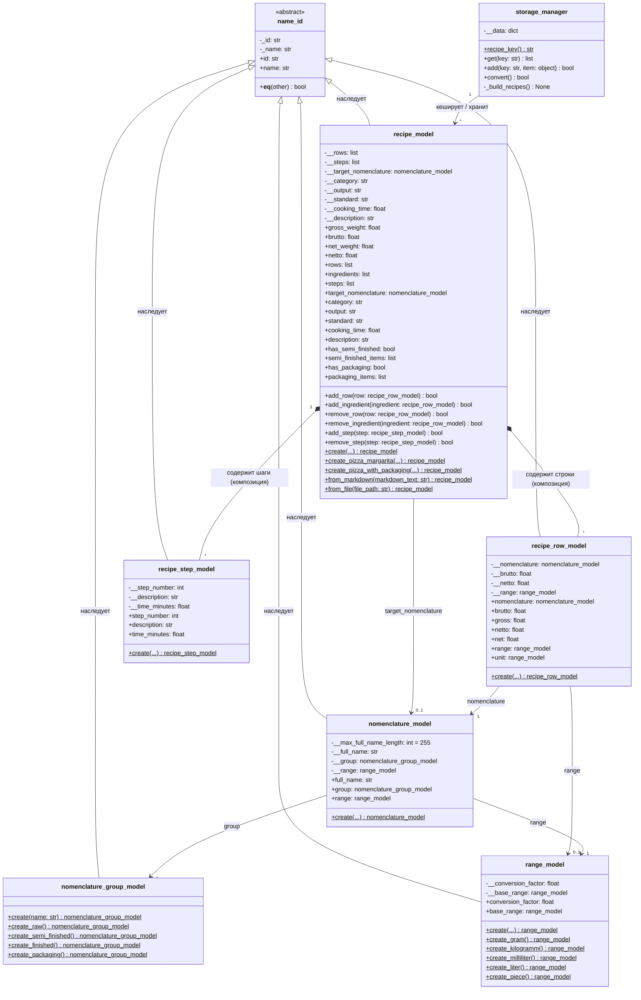

# Рецепт: Пицца Маргарита

**Категория:** Готовая продукция  
**Время приготовления:** 45 мин (подготовка 20 мин + выпечка 25 мин)  
**Выход:** 1 пицца Ø 30 см (600 г)  
**Стандарт:** Технологическая карта № ТК-001

---

## Состав (на 1 порцию)

| Наименование | Единица | Брутто | Нетто |
|---|---|---|---|
| Тесто дрожжевое (полуфабрикат) | г | 280 | 250 |
| Соус томатный (полуфабрикат) | г | 120 | 100 |
| Сыр Моцарелла | г | 180 | 150 |
| Масло оливковое | мл | 20 | 20 |
| Базилик свежий | г | 10 | 8 |
| Соль пищевая | г | 3 | 3 |

---

## Технология приготовления

### 1. Подготовка теста

1. Достать тесто дрожжевое (полуфабрикат) из холодильника за **30 минут** до начала работы.
2. Раскатать тесто на посыпанной мукой поверхности до круга диаметром **30–32 см**, толщиной **3–4 мм**.
3. Переложить на смазанный маслом противень или пекарский камень.
4. Края теста слегка подвернуть для формирования бортика (~1 см).

### 2. Нанесение соуса

1. Выложить **100 г** томатного соуса (полуфабрикат) на основу теста.
2. Распределить ложкой круговыми движениями, **отступив 2 см** от края.
3. Лёгким движением посолить поверхность соуса (1 г соли).

### 3. Сборка

1. Моцареллу нарезать кружками толщиной **5 мм** или разорвать руками.
2. Равномерно распределить по всей поверхности соуса.
3. Сбрызнуть оливковым маслом (20 мл).
4. Посолить по вкусу (2 г соли).

### 4. Выпекание

| Параметр | Значение |
|---|---|
| Температура | **250–270 °C** |
| Время | **8–12 минут** |
| Режим | Конвекция + нижний нагрев |

> Пицца считается готовой, когда края теста подрумянились, а сыр расплавился и начал слегка пузыриться.

### 5. Подача

1. Вынуть пиццу из духовки. **Дать отдохнуть 2 минуты.**
2. Разложить листья свежего базилика поверх расплавленного сыра.
3. Нарезать на **8 равных секторов** дисковым ножом.
4. Подать немедленно на разогретой тарелке или картонной подложке.

---

## Требования к качеству

| Показатель | Норма |
|---|---|
| Внешний вид | Круглая форма, равномерный румяный цвет корочки |
| Тесто | Хрустящее снаружи, мягкое внутри |
| Начинка | Сыр полностью расплавлен, без подгорания |
| Запах | Характерный аромат выпеченного теста, томатов, базилика |
| Температура подачи | Не ниже **65 °C** |
| Выход готового блюда | **600 ± 20 г** |

---

## Связанные доменные объекты

```
nomenclature_model("Тесто дрожжевое")  →  group: "Полуфабрикаты",  range: "грамм"
nomenclature_model("Соус томатный")    →  group: "Полуфабрикаты",  range: "грамм"
nomenclature_model("Мука пшеничная")   →  group: "Сырьё",          range: "килограмм"
nomenclature_model("Масло подсолнечное")→ group: "Сырьё",          range: "литр"
nomenclature_model("Соль")             →  group: "Сырьё",          range: "килограмм"
nomenclature_model("Коробка 30 см")    →  group: "Упаковка",       range: "штука"
```

## UML диаграмма доменных моделей рецепта



---

*Редакция: 2026-10-03 | Автор: Технолог ООО Ромашка*
