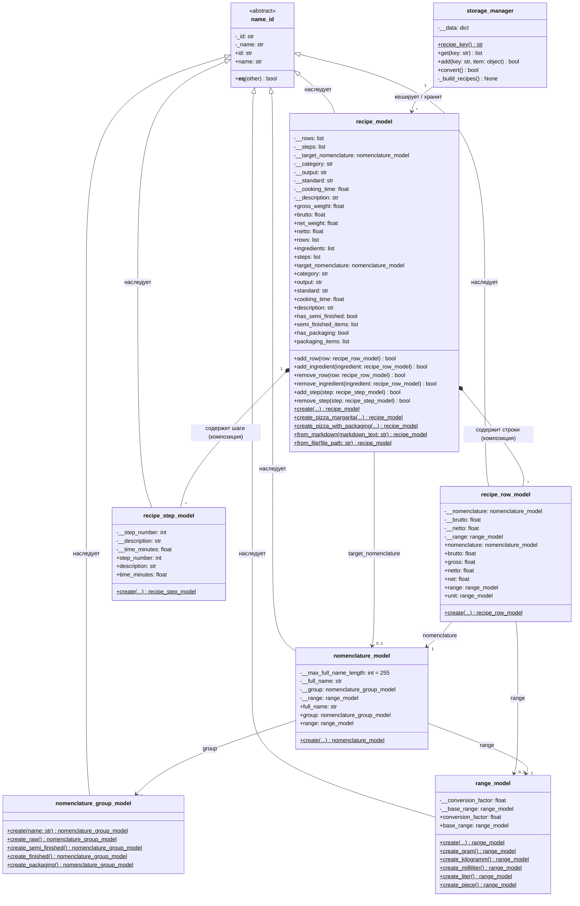

# Диаграмма классов — Доменные модели рецептов (технологических карт)

## Описание
В рамках предметной области сети ресторанов «Ромашка» реализована подсистема технологических карт (рецептов) для производственного учета:
- `recipe_model`: технологическая карта блюда или заготовки. Вычисляет общий вес Брутто и Нетто путем суммирования весов всех входящих ингредиентов. Содержит ссылки на полуфабрикаты, готовую продукцию, шаги приготовления и упаковочные материалы.
- `recipe_row_model`: строка технологической карты (ингредиент блюда). Хранит ссылку на позицию номенклатуры (`nomenclature_model`), вес Брутто, вес Нетто и единицу измерения (`range_model`).
- `recipe_step_model`: этап (шаг) технологического процесса приготовления (номер, наименование, описание, продолжительность).

## UML диаграмма классов

