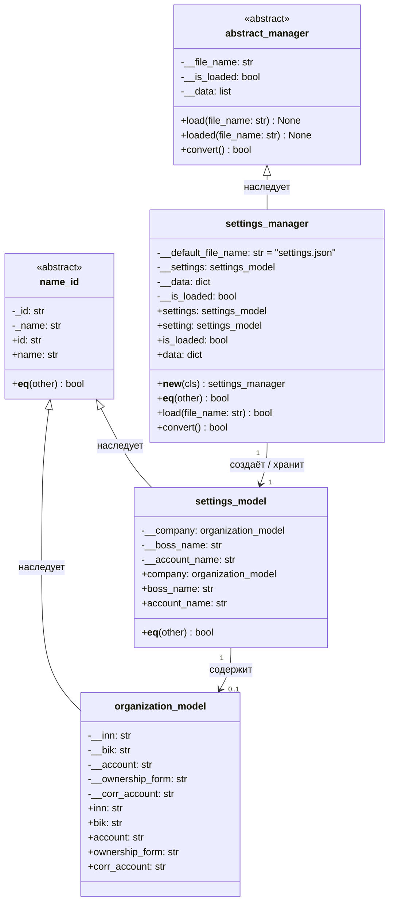

# Диаграмма классов — settings_manager

```mermaid
classDiagram
    direction TB

    class abstract_manager {
        <<abstract>>
        -__file_name: str
        -__is_loaded: bool
        -__data: list
        +load(file_name: str) None
        +loaded(file_name: str) None
        +convert() bool
    }

    class settings_manager {
        -__default_file_name: str = "settings.json"
        -__settings: settings_model
        -__data: dict
        -__is_loaded: bool
        +settings: settings_model
        +setting: settings_model
        +is_loaded: bool
        +data: dict
        +__new__(cls) settings_manager
        +__eq__(other) bool
        +load(file_name: str) bool
        +convert() bool
    }

    class settings_model {
        -__company: organization_model
        -__boss_name: str
        -__account_name: str
        +company: organization_model
        +boss_name: str
        +account_name: str
        +__eq__(other) bool
    }

    class organization_model {
        -__inn: str
        -__bik: str
        -__account: str
        -__ownership_form: str
        -__corr_account: str
        +inn: str
        +bik: str
        +account: str
        +ownership_form: str
        +corr_account: str
    }

    class name_id {
        <<abstract>>
        -_id: str
        -_name: str
        +id: str
        +name: str
        +__eq__(other) bool
    }

    abstract_manager <|-- settings_manager : наследует
    name_id <|-- settings_model : наследует
    name_id <|-- organization_model : наследует
    settings_manager "1" --> "1" settings_model : создаёт / хранит
    settings_model "1" --> "0..1" organization_model : содержит
```