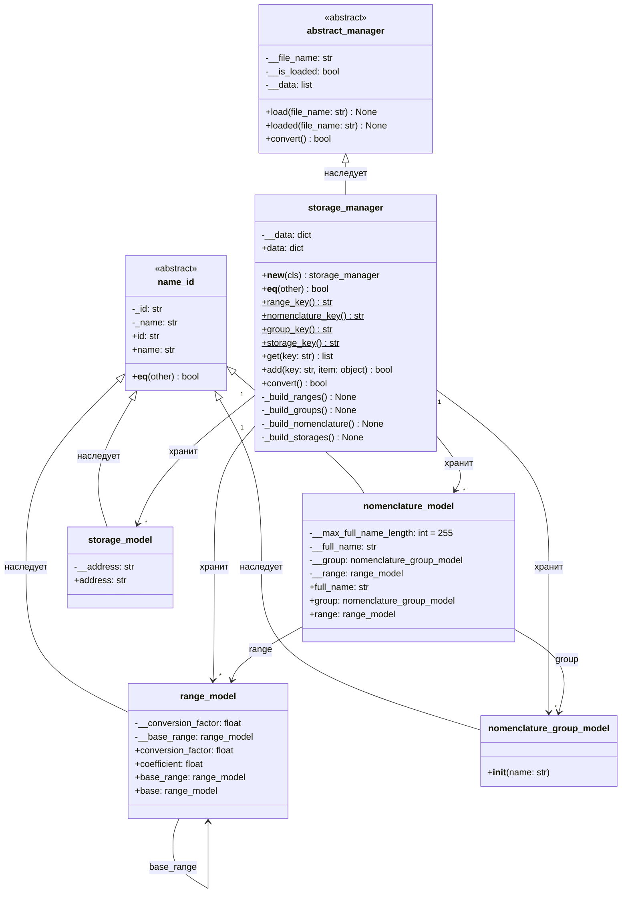

# Диаграмма классов — storage_manager

```mermaid
classDiagram
    direction TB

    class abstract_manager {
        <<abstract>>
        -__file_name: str
        -__is_loaded: bool
        -__data: list
        +load(file_name: str) None
        +loaded(file_name: str) None
        +convert() bool
    }

    class storage_manager {
        -__data: dict
        +data: dict
        +__new__(cls) storage_manager
        +__eq__(other) bool
        +range_key() str$
        +nomenclature_key() str$
        +group_key() str$
        +storage_key() str$
        +get(key: str) list
        +add(key: str, item: object) bool
        +convert() bool
        -_build_ranges() None
        -_build_groups() None
        -_build_nomenclature() None
        -_build_storages() None
    }

    class range_model {
        -__conversion_factor: float
        -__base_range: range_model
        +conversion_factor: float
        +coefficient: float
        +base_range: range_model
        +base: range_model
    }

    class nomenclature_group_model {
        +__init__(name: str)
    }

    class nomenclature_model {
        -__max_full_name_length: int = 255
        -__full_name: str
        -__group: nomenclature_group_model
        -__range: range_model
        +full_name: str
        +group: nomenclature_group_model
        +range: range_model
    }

    class storage_model {
        -__address: str
        +address: str
    }

    class name_id {
        <<abstract>>
        -_id: str
        -_name: str
        +id: str
        +name: str
        +__eq__(other) bool
    }

    abstract_manager <|-- storage_manager : наследует
    name_id <|-- range_model : наследует
    name_id <|-- nomenclature_group_model : наследует
    name_id <|-- nomenclature_model : наследует
    name_id <|-- storage_model : наследует

    storage_manager "1" --> "*" range_model : хранит
    storage_manager "1" --> "*" nomenclature_group_model : хранит
    storage_manager "1" --> "*" nomenclature_model : хранит
    storage_manager "1" --> "*" storage_model : хранит

    nomenclature_model --> nomenclature_group_model : group
    nomenclature_model --> range_model : range
    range_model --> range_model : base_range
```